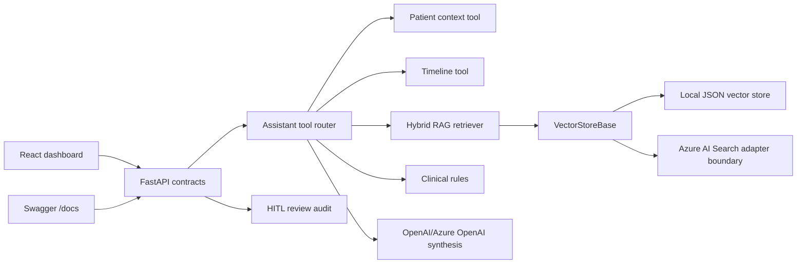

# Clinical AI Platform

AI Assistant for Clinical Gap Intelligence across synthetic patient records.

This project pairs a FastAPI backend with a React dashboard for patient-specific care gap analysis, documentation review, revenue and quality risk triage, evidence retrieval, timeline review, and human-in-the-loop audit capture. The platform is designed around auditable RAG: every answer includes retrieved context, rule outputs, model status, latency, and review metadata.

For demonstration with synthetic data only.

## Product Flow

1. Select or search a synthetic patient in the React workspace.
2. Ask a clinical gap intelligence question.
3. The backend builds patient context, retrieves relevant evidence, runs clinical rules, generates an answer, validates grounding, and logs audit metadata.
4. Reviewers can mark gaps as `needs_review`, `accepted`, or `dismissed`.
5. Swagger remains available for direct API inspection at `/docs`.

## Architecture



## Backend Contract

Primary endpoint:

```bash
curl -X POST http://localhost:8000/ask \
  -H "Content-Type: application/json" \
  -d "{\"patient_id\":\"p001\",\"question\":\"What care gaps exist for this patient?\",\"data_source\":\"synthea\"}"
```

`/ask` returns:

- `patient_summary`
- `care_gaps`, `documentation_gaps`, `revenue_quality_risks`
- `recommended_actions`
- `supporting_evidence` and `retrieved_context`
- `timeline_events` and `timeline_summary`
- `audit` with request ID, timestamp, retrieval strategy, retrieved chunk count, rules fired, model status, and latency

Additional endpoints:

- `GET /patients/search`
- `GET /index/status`
- `POST /review/gap`
- `POST /index/build`
- `GET /live/overview`
- `POST /analyze-patient`

## Local Setup

```bash
python -m venv .venv
.\.venv\Scripts\python.exe -m pip install -r requirements.txt
.\.venv\Scripts\python.exe -m uvicorn app.api.main:app --host 127.0.0.1 --port 8000
```

React frontend:

```bash
cd frontend
npm install
npm run dev
```

Open:

- React app: `http://127.0.0.1:8501`
- Swagger: `http://127.0.0.1:8000/docs`
- Health: `http://127.0.0.1:8000/health`

PowerShell helper:

```powershell
.\scripts\start_local.ps1
```

The helper falls back to the next available API or frontend port if the default port is busy.

## Configuration

Use `.env` for local secrets. Do not commit `.env`.

```env
OPENAI_API_KEY=
OPENAI_MODEL=gpt-4.1-mini
AZURE_OPENAI_API_KEY=
AZURE_OPENAI_ENDPOINT=
AZURE_OPENAI_DEPLOYMENT=
```

When model credentials are not configured, the assistant returns a deterministic fallback answer with the same evidence and audit contract.

## Docker

```bash
docker compose up --build
```

Services:

- API: `http://localhost:8000`
- React frontend: `http://localhost:8501`

The Docker ignore file excludes local secrets, audit logs, cached vector indexes, virtual environments, and frontend build artifacts.

## Retrieval And RAG Quality

- `VectorStoreBase` defines the retrieval boundary.
- `LocalJSONVectorStore` supports deterministic local development.
- `FaissVectorStore`, `ChromaVectorStore`, and `AzureAISearchVectorStore` are adapter boundaries for production vector infrastructure.
- `HybridRetriever` combines vector similarity and lexical matches filtered by patient ID.
- The response exposes retrieved context and audit metadata so frontend and tests can inspect grounding.

Run the lightweight evaluation harness against a running API:

```bash
python evals/run_eval.py --base-url http://127.0.0.1:8000
```

## Tests

```bash
pytest
```

Coverage includes:

- API health and `/ask` response contract
- patient search and index status contracts
- retrieval patient filtering
- clinical rules, timeline, and ingestion behavior
- React frontend contract labels and API integration points
- human review audit endpoint

## Frontend

The React workspace includes:

- sidebar patient search, filters, and demographics
- professional status header
- clinical question workspace with suggested prompts
- KPI cards
- tabs for AI Answer, Care Gaps, Documentation, Revenue & Quality, Evidence, Patient Timeline, and Audit Trail
- loading, empty, and error states
- human-in-the-loop gap review actions

Screenshot placeholders:

- `docs/screenshots/react-dashboard.png`
- `docs/screenshots/swagger-ask-contract.png`

## Security Notes

- Synthetic data only.
- No API keys or environment files should be committed.
- Local vector indexes and audit event logs are ignored.
- Review outputs before operational use.
